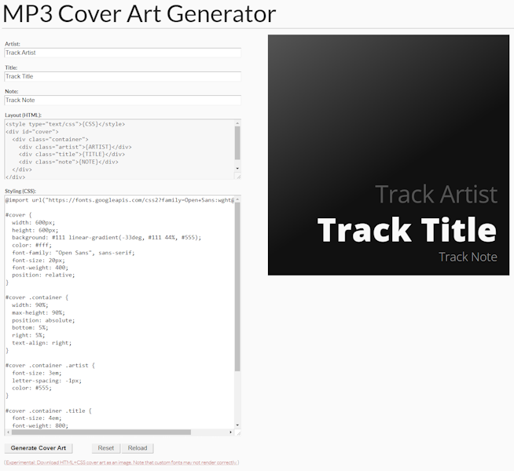

# Cover Art Generator

This is a tiny PHP web utility to create modest cover art graphics for use with MP3s, etc.

Given a simple static HTML template, the cover background, artist name, track/album title and note/description can be styled using regular CSS statements.



## Installation

Copy the `/coverart` directory to your web host. Either modify the index file to suit your needs or (PHP) include `generate.php` directly in a page on your site.

## Usage

Complete the fields "Artist", "Title" and "Note", then click the "Generate Cover" button to create a basic cover in the default style. Use your favorite screenshot app to capture a copy of the rendered HTML+CSS artwork.

## Styling

You can also replace the default template's CSS with your own code to re-style the HTML template to your taste.

```HTML
<style type="text/css">{CSS}</style>
<div id="cover">
  <div class="container">
    <div class="artist">{ARTIST}</div>
    <div class="title">{TITLE}</div>
    <div class="note">{NOTE}</div>
  </div>
</div>
```

* `div#cover`: The overall cover. Set your background color, image, etc. here. Cover art dimensions are also set here--a height and width of at least 600px is suggested.
  * `div.container`: Container block which holds the cover art text elements.
    * `div.artist`: Artist name.
    * `div.title`: Title of the track/album.
    * `div.note`: Note regarding (or description of) the track/album.
    * Note: If you don't want to use the Artist, Title and/or Note field, define its style as `display: none;`.

## Creating Custom Templates

If you wish to use the same basic cover art design and/or field values repeatedly, you can save your modifications as a custom template.

A copy of the default field values and CSS code are stored in `/coverart/templates/plain.php`.

Make a copy of `plain.php` giving it a unique filename which you'll use to load your chosen template later. Edit the following PHP variables as desired:
* `$template_artist`
* `$template_title`
* `$template_note`
* `$template_css`

(Note that `$template_...` values which are not specified in your new `/coverart/templates/<my_custom_template>.php` file will draw from the application's defaults. Therefore, if you want the Note field to be blank, for example; be sure to specify `$template_note = '';` in your template.)

## Using a Custom Template

Simply visit `https://<my_site.com>/coverart/index.php?template=<my_custom_template>` where the template query string value corresponds to the basename of a file in the `/coverart/templates/` directory.
